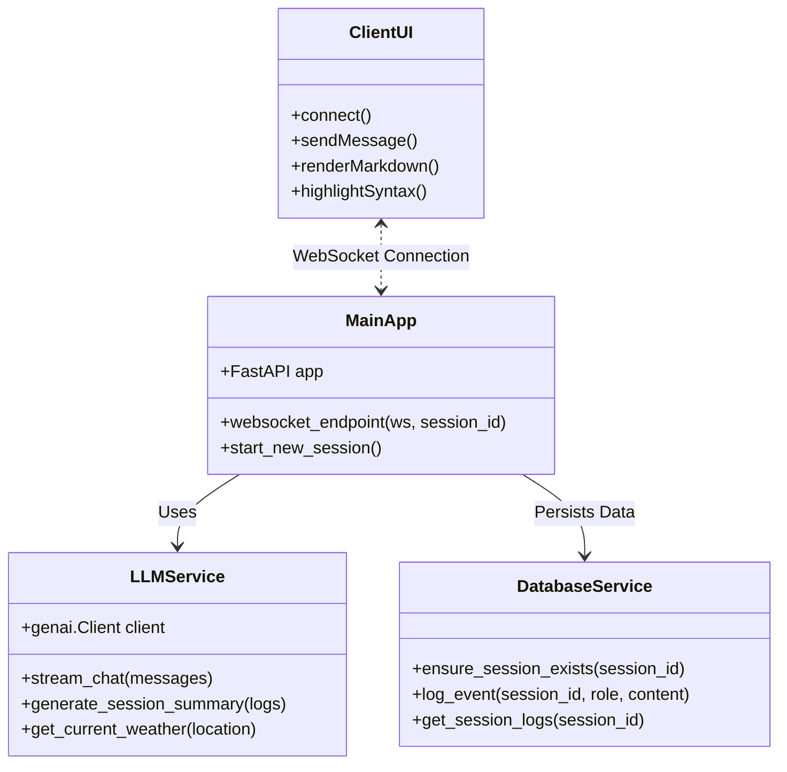
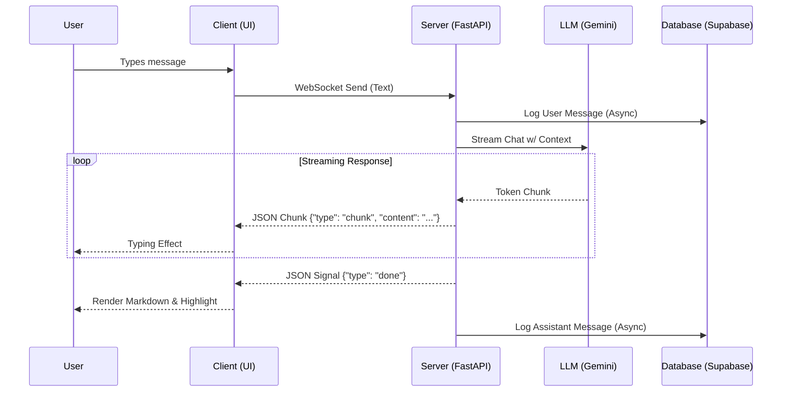
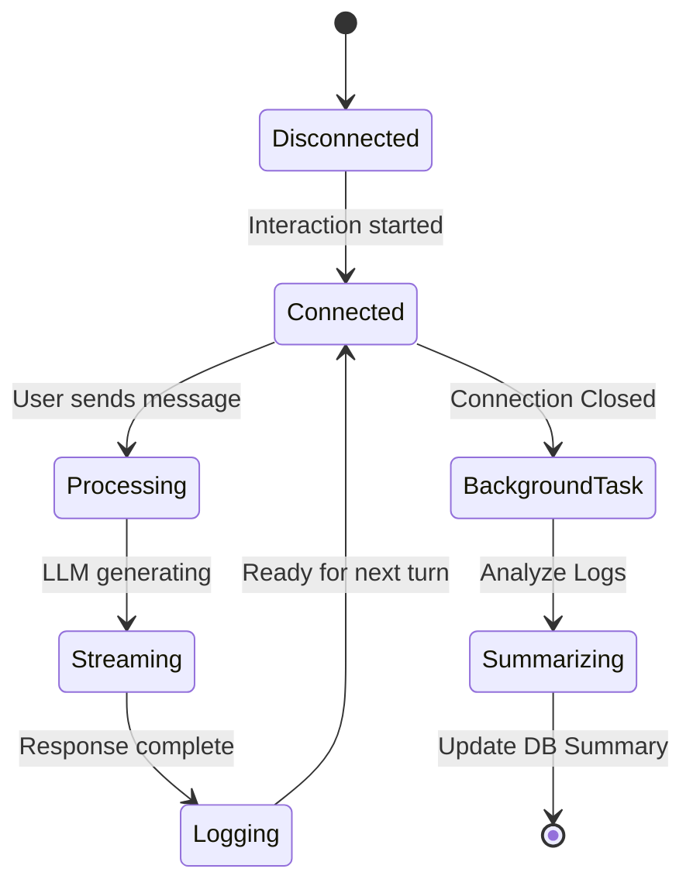

# Real-time AI Conversational Backend

## Project Overview

This project implements a high-performance, real-time conversational AI backend designed to handle low-latency interactions. It leverages **FastAPI** for asynchronous request handling and **WebSockets** for bi-directional streaming. The core intelligence is powered by **Google's Gemini 2.5 Flash** model (via the `google-genai` SDK), capable of tool calling and context-aware responses. Persistence is managed by **Supabase**, storing session metadata and granular event logs. A modern, responsive web interface provides a polished user experience with markdown rendering and syntax highlighting.

## Tech Stack

- **Backend Framework**: FastAPI (Python 3.8+)
- **Communication Protocol**: WebSockets (Async)
- **AI Engine**: Google Gemini API (`gemini-2.5-flash`) via `google-genai` SDK
- **Database**: Supabase (PostgreSQL)
- **Frontend**: HTML5, CSS3, JavaScript (Vanilla)
- **Libraries**: `uvicorn`, `websockets`, `pydantic`, `python-dotenv`, `aiofiles`, `marked.js`, `highlight.js`

## System Architecture

The system follows a modular microservices-lite architecture:

1.  **Client Layer**: A web-based frontend that establishes a persistent WebSocket connection.
2.  **API Gateway / Application Layer**: FastAPI handles routing, static file serving, and connection management.
3.  **Service Layer**:
    - **LLM Service**: Manages interactions with Google Gemini, handling streaming and tool execution.
    - **Task Service**: Runs background jobs for session summarization.
4.  **Data Layer**: Supabase acts as the persistent store for chat logs and session states.

### System Diagrams

#### Class Diagram




#### Sequence Diagram (Message Flow)




#### Activity Diagram (Session Lifecycle)




## Functional Requirements

1.  **Real-time Communication**: Establish and maintain persistent WebSocket connections.
2.  **AI Integration**: Integrate Google Gemini 2.5 Flash for conversational intelligence.
3.  **Tool Calling**: The AI must demonstrate the ability to call external functions (e.g., simulated Weather API).
4.  **Streaming Responses**: Text must be streamed token-by-token for low latency.
5.  **Persistence**: All chat events (User, AI, Tools) must be logged to a database.
6.  **Session Management**: Support persistent sessions that can be resumed or cleared ("New Chat").
7.  **Rich UI Formatting**: Render Markdown and Syntax Highlighting for code.
8.  **Error Handling**: Gracefully handle API failures (e.g., Quota Exceeded) without crashing.

## Non-Functional Requirements

1.  **Performance**: Minimal latency < 200ms for first token generation.
2.  **Scalability**: Async I/O (asyncio) ensures the server can handle multiple concurrent connections.
3.  **Reliability**: Automatic reconnection logic on the frontend; robust exception handling on the backend.
4.  **Usability**: Clean, chat-like interface with visual indicators for connection status.

## Database Schema Overview

The Supabase project contains two primary tables:

1.  **`sessions`**

    - `id` (UUID, Primary Key): Unique session identifier.
    - `created_at` (Timestamp): Creation time.
    - `summary` (Text): LLM-generated summary of the conversation.

2.  **`event_logs`**
    - `id` (Integer, Primary Key): Auto-incrementing log ID.
    - `session_id` (UUID, Foreign Key): Links to `sessions`.
    - `role` (String): 'user', 'assistant', or 'tool'.
    - `content` (Text): The message content.
    - `created_at` (Timestamp): Event time.

## Application Flow

1.  **Initialization**: User opens the web page. A UUID is generated or retrieved from LocalStorage.
2.  **Connection**: WebSocket connects to `/ws/session/{uuid}`.
3.  **Context Loading**: Backend pulls previous chat history from Supabase and loads it into the session context.
4.  **Interaction**:
    - User sends a message.
    - Backend validates session existence.
    - Message is forwarded to Gemini API.
    - Response streams back to Client in JSON chunks.
    - Client renders text progressively.
5.  **Completion**: Upon stream finish, client renders Markdown/Code. Backend logs the full response.
6.  **Termination**: If user leaves, a background task generates a summary of the session.

## Setup Instructions

### Prerequisites

- Python 3.8+
- Supabase Account & Project
- Google AI Studio API Key

### Steps

1.  **Clone the Repository**
2.  **Install Dependencies**
    ```bash
    pip install -r requirements.txt
    ```
    ```bash
    pip install google-generativeai
    ```

3.  **Configure Environment**
    - Create a `.env` file from `.env.example`.
    - Enter your `SUPABASE_URL`, `SUPABASE_KEY`, and `GEMINI_API_KEY`.
4.  **Database Migration**
    - Run the SQL scripts in `supabase_schema.sql` via the Supabase SQL Editor to create tables.
5.  **Run the Server**
    ```bash
    uvicorn app.main:app --reload
    ```
6.  **Access the Application**
    - Navigate to `http://localhost:8000` in your web browser.

## Design Decisions

- **Why WebSockets?** HTTP polling is inefficient for chat. WebSockets provide a full-duplex persistent channel essential for real-time streaming experiences.
- **Why FastAPI?** Its native support for `asyncio` and WebSockets makes it superior to Flask/Django for high-concurrency real-time apps.
- **Why Supabase?** Provides a fully managed PostgreSQL backend with an easy-to-use API, perfect for rapid prototyping and scale.
- **Why Gemini 2.5 Flash?** Optimized for speed (low latency) and cost-efficiency (free tier availability), making it ideal for real-time interactive applications.

## Limitations

- **Free Tier Quotas**: The application is subject to Google Gemini's free tier rate limits (RPM/TPM). A fallback "Mock Mode" handles `429 Resource Exhausted` errors.
- **No Auth**: Currently, sessions are client-side generated (UUID). There is no secure user authentication.


## Future Enhancements

- **Authentication**: Integrate Supabase Auth for secure user login.
- **Vector Memory**: Implement RAG (Retrieval-Augmented Generation) using `pgvector` for long-term memory.
- **Voice Interface**: Add Speech-to-Text (STT) and Text-to-Speech (TTS) for voice conversations.
- **Deployment**: Dockerize the application and deploy to a cloud provider like Render or Railway.


## Deployment Note

This project is designed to run locally for evaluation purposes.  
Due to free-tier API constraints and quota limits, the application was intentionally kept local to ensure consistent behavior during review.  
The architecture is deployment-ready and can be hosted with minimal changes.
